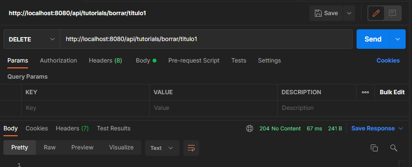
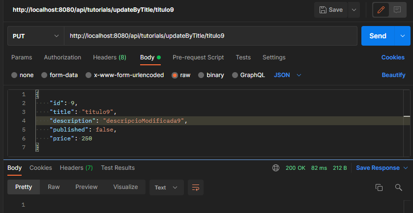

## Actividad ApiRest ##

#### Método deleteByTitle ####

Este método se encarga de borrar una entidad de
la base de datos en base al valor de su título.

#### Método updateByTitle ####

Este metodo se encarga de actualizar los datos de una entidad 
dada. La forma en la que se identifica a esa entidad
es mediante el valor de su titulo.

#### Método getPriceById ####

Este método se encarga de devolver el valor de precio
de una entidad dada. La entidad de identifica por su id.
